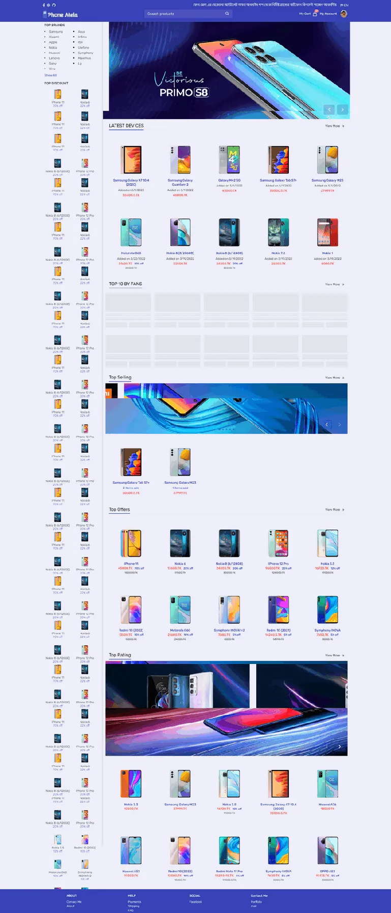
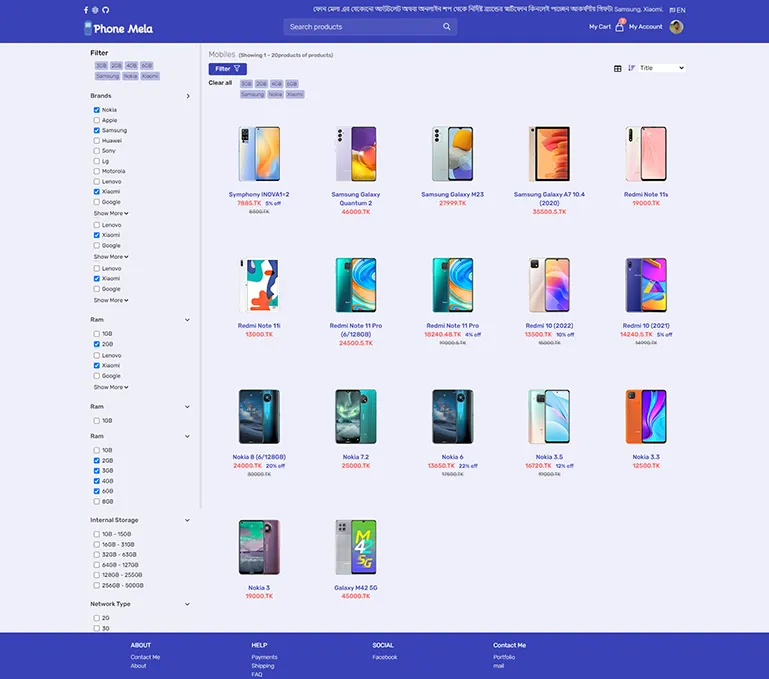
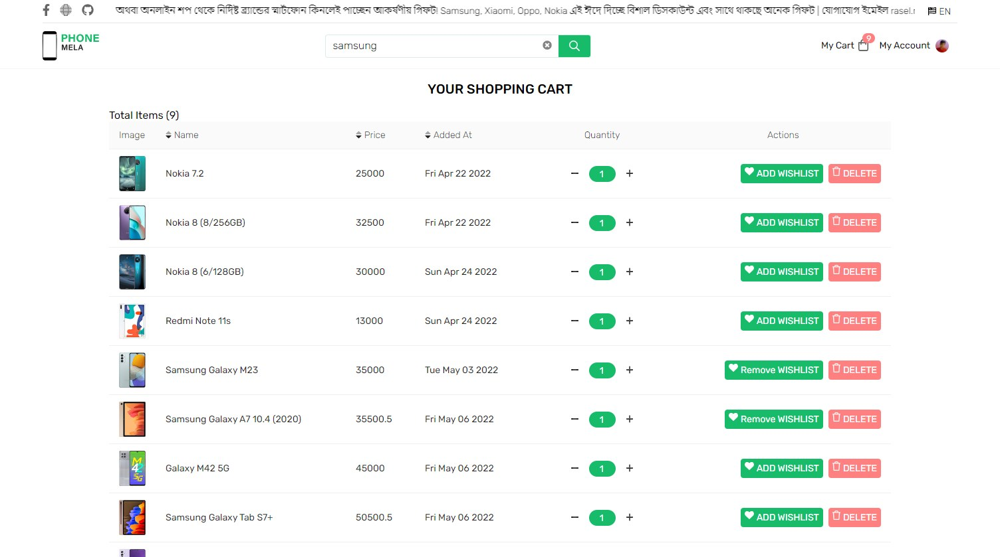
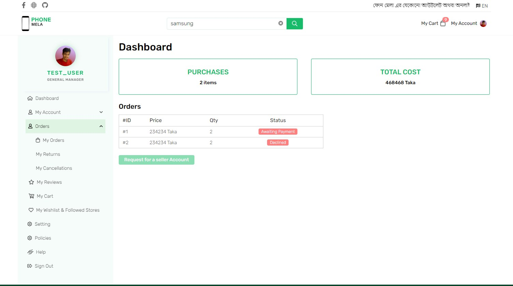
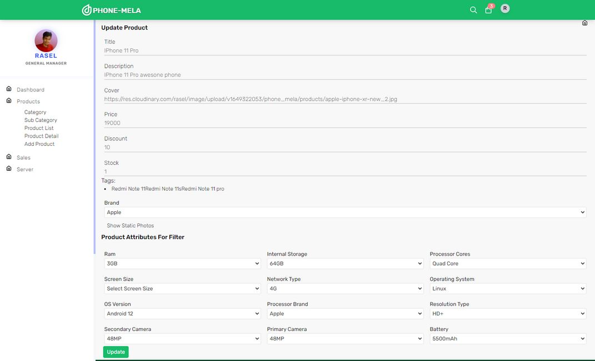

## Phone Mela (Frontend)

Phone Mela is Online buying the best smartphone. In this website customer can find smartphone, search mobile phone using title,
filter with varies attributes.
Customer can add mobile wishlist, cart, also they can buy with credit card and cash on delivery build with Nodejs, React js and Mongodb

## Application Features
- Search mobile phone using title, filter with varies attributes.
- It has multiple role customer and admin, customer can buy products. 
- Also has customer and admin dashboard.
- Admin user can add product, update, delete. Block customer.
- Customer can add mobile in wish list, cart, also they can buy.
- CASH ON Delivery and STRIPE credit payment
- Advanced Product adding form, Product Attribute, Cover, Deep description handle user-friendly. 
- Login with Oauth Google Account

# This Application under development

Live Link https://phone-mela1.netlify.app

## Technology used.
- Typescript
- React
- Redux
- react-router-dom (Route base code spliting)
- Tailwindcss
- stripe-payments
- expressjs
- mongoose
- bcryptjs
- formidable
- jsonwebtoken etc....

### Preview screenshot

#### Homepage

 

#### Product Filter Page

 

#### Carts Items

 

####  Customer Dashboard

 

####  Admin Dashboard Adding Product

